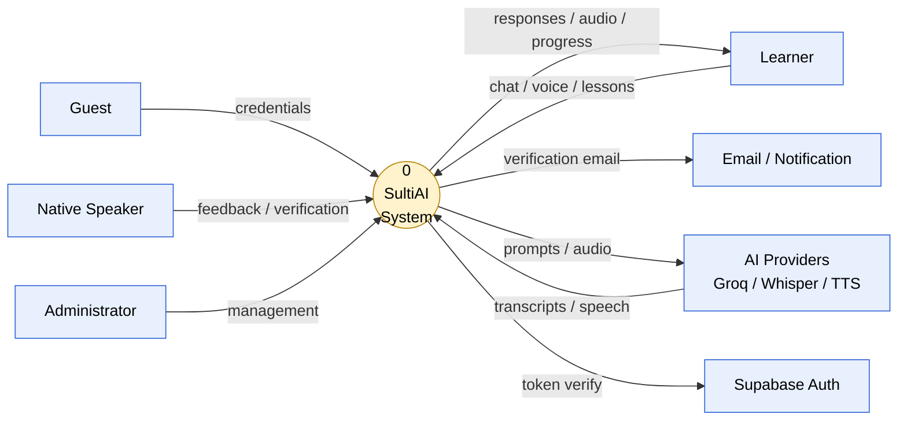
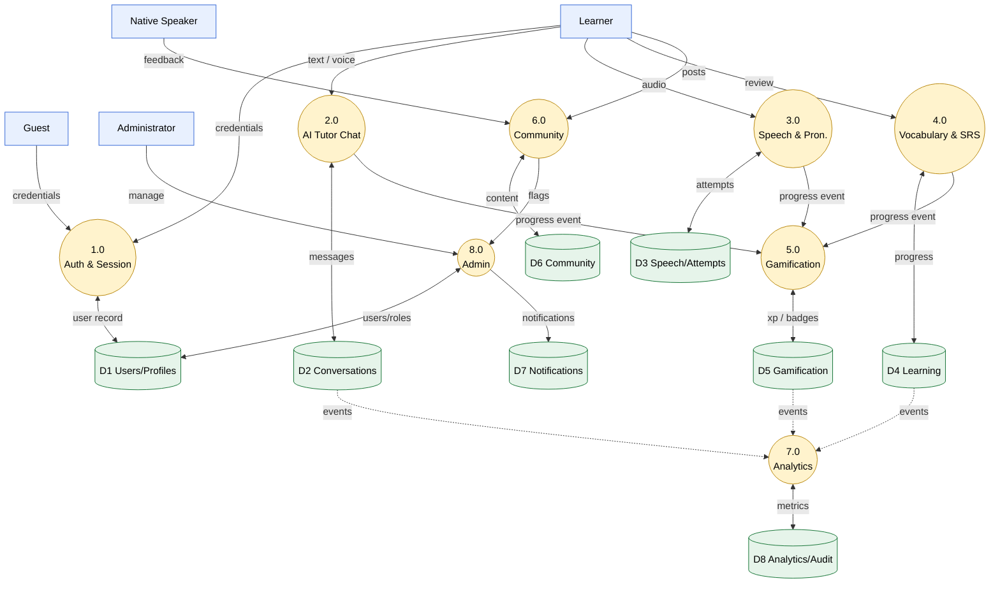

# Data Flow Diagram (DFD) Document

## 1. Introduction

This document presents the leveled Data Flow Diagrams (DFDs) for SultiAI, an AI-powered Bisaya language-learning platform. The DFDs model how data moves between external entities, processes, and data stores across the system.

The diagrams are leveled (Context → Level 1 → Level 2) and follow Gane–Sarson notation.

---

## 2. Notation

| Symbol | Name | Meaning |
|--------|------|---------|
| `[ Entity ]` | External Entity | Source or sink of data outside the system boundary |
| `( Process )` | Process | Transforms incoming data into outgoing data |
| `D# =====` | Data Store | Passive repository of data at rest |
| `──────▶` | Data Flow | Named movement of data between elements |

**Balancing rule:** every data flow entering or leaving a process at Level *n* must be decomposed into matching flows at Level *n+1*.

---

## 3. Level 0 — Context Diagram

The entire SultiAI system is represented as a single process interacting with its external entities.

```
   ──────────┐                            ┌───────────────────────┐                            ──────────────────────┐
   │  Guest   │──── credentials ──────────▶│                       │──── verification email ───▶│  Email /             │
   └──────────┘                            │                       │                            │  Notification Svc    │
   ──────────┐                            │                       │                            ──────────────────────┘
   │ Learner  │──── chat / voice / ───────▶│           0           │                            ┌──────────────────────┐
   │          │      lessons              │                       │──── prompts / audio ──────▶│  AI Providers        │
   └──────────┘◀─── responses / ───────────│      SultiAI          │◀─── transcripts / ─────────│  Groq / Whisper /    │
   ┌──────────┐      audio / progress      │      System           │      synthesized speech    │  TTS                 │
   │  Native  │                            │                       │                            └──────────────────────
   │  Speaker │──── feedback / ───────────▶│                       │                            ──────────────────────┐
   └──────────┘      verification          │                       │──── token verification ───▶│  Supabase Auth       │
   ┌──────────┐                            │                       │◀─── session result ────────│                      │
   │  Admin   │──── management / ─────────▶│                       │                            └──────────────────────┘
   │          │      moderation            │                       │
   ──────────┘─── admin data / ──────────│                       │
```

### Context-Level Data Flows

| ID | Flow | From | To | Description |
|----|------|------|----|-------------|
| F0.1 | Registration / login credentials | Guest, Learner | SultiAI System | Sign-up and sign-in data |
| F0.2 | Chat / voice / lesson requests | Learner | SultiAI System | Learning activity requests |
| F0.3 | Feedback & verification requests | Native Speaker | SultiAI System | Corrections and speaker verification |
| F0.4 | Management & moderation commands | Admin | SultiAI System | User/content administration |
| F0.5 | Progress, responses, audio | SultiAI System | Learner | Tutoring replies, progress, TTS audio |
| F0.6 | Verification email | SultiAI System | Email/Notification Service | Account & notification emails |
| F0.7 | LLM prompts / audio for STT | SultiAI System | AI Providers | Outbound AI requests |
| F0.8 | Transcripts / synthesized speech | AI Providers | SultiAI System | Inbound AI results |
| F0.9 | Token verification | SultiAI System | Supabase Auth | Session/token validation |

---

## 4. Level 1 — System Decomposition

The context process `0` is decomposed into eight major processes.

```
   ┌──────────┐   credentials   ┌────────────────────────┐   user record   ┌─────────────────────┐
   │  Guest   │────────────────▶│ 1.0 Authentication &   │────────────────▶│ D1 Users / Profiles │
   │ Learner  │◀────────────────│     Session Management │◀─── profile ────│    / User Sessions  │
   └──────────┘   JWT + profile  ────────────────────────┘                 └─────────────────────

   ┌──────────┐   text / voice  ┌────────────────────────┐   messages      ┌─────────────────────┐
   │ Learner  │────────────────▶│ 2.0 AI Tutor Chat      │────────────────▶│ D2 Conversations /  │
   └──────────┘─── AI reply ───│     (Groq LLaMA)      │◀─── context ────│    Messages /       │
                                 └───────────┬────────────┘                 │    Summaries        │
                                             │ prompt / completion          └─────────────────────┘
                                             ▼
                                 ┌────────────────────────
                                 │ AI Provider (Groq)     │
                                 └────────────────────────┘

   ──────────┐   audio         ┌────────────────────────┐   scores        ┌─────────────────────┐
   │ Learner  │────────────────▶│ 3.0 Speech &           │────────────────▶│ D3 Speech Records / │
   └──────────┘◀── score + TTS ─│     Pronunciation      │◀─── history ────│    Pronunciation    │
                                 └───────────┬────────────┘                 │    Attempts         │
                                             │ audio / transcript           └─────────────────────┘
                                             ▼
                                 ┌────────────────────────
                                 │ Whisper / MS Edge TTS  │
                                 └────────────────────────┘

   ──────────┐  lesson / review┌────────────────────────┐   progress      ┌─────────────────────
   │ Learner  │────────────────▶│ 4.0 Vocabulary &       │────────────────▶│ D4 Learning Modules │
   └──────────┘◀── next cards ──│     Spaced Repetition  │─── due cards ──│    / Progress /     │
                                 └────────────────────────┘                 │    Vocab Reviews    │
                                                                            └─────────────────────

   ┌──────────┐  activity done  ┌────────────────────────┐   xp / streak   ┌─────────────────────┐
   │ Learner  │────────────────▶│ 5.0 Gamification       │────────────────▶│ D5 XP Logs /        │
   └──────────┘◀── XP + badges ─│     (XP / Achievements)│◀─── stats ──────│    Achievements /   │
                                 └────────────────────────┘                 │    Leaderboard      │
                                                                            └─────────────────────

   ┌──────────┐  post / comment ┌────────────────────────┐   content       ┌─────────────────────┐
   │ Learner  │────────────────▶│ 6.0 Community &        │────────────────▶│ D6 Posts / Comments │
   │  Native  │◀── feed / ──────│     Moderation         │◀─── feed ───────│    / Likes / Reports│
   │  Speaker │      feedback    └───────────┬────────────┘                 └─────────────────────┘
   └──────────┘                              │ flagged content
                                             ▼
                                 ┌────────────────────────┐
                                 │ Admin moderation queue │
                                 ────────────────────────┘

   ┌──────────┐  report request ┌────────────────────────   metrics       ┌─────────────────────┐
   │ Learner  │────────────────▶│ 7.0 Analytics &        │────────────────▶│ D8 Learning         │
   │  Admin   │◀── dashboards ──│     Reporting          │◀── raw events ──│    Analytics /      │
   └──────────┘                 ────────────────────────┘                 │    Audit Logs       │
                                                                            └─────────────────────

   ┌──────────┐  manage users   ┌────────────────────────┐   user / role   ┌─────────────────────┐
   │  Admin   │────────────────▶│ 8.0 Admin & User       │────────────────▶│ D1 Users /          │
   ──────────┘── admin data ──│     Management         │◀── data ────────│    D7 Notifications │
                                 └────────────────────────┘                 └─────────────────────┘
```

### Level-1 Process Summary

| Process | Name | Primary Inputs | Primary Outputs |
|---------|------|----------------|-----------------|
| 1.0 | Authentication & Session Management | Credentials, tokens | JWT, profile, session record |
| 2.0 | AI Tutor Chat | Text/voice prompts | AI replies, conversation records |
| 3.0 | Speech & Pronunciation | Audio, expected phrase | Pronunciation score, TTS audio |
| 4.0 | Vocabulary & Spaced Repetition | Lesson/review actions | Due cards, progress updates |
| 5.0 | Gamification | Completed activities | XP, streaks, badges, leaderboard |
| 6.0 | Community & Moderation | Posts, comments, reports | Feed, moderation queue |
| 7.0 | Analytics & Reporting | Activity events | Dashboards, metrics |
| 8.0 | Admin & User Management | Admin commands | Updated users, roles, notifications |

### Level-1 Data Stores

| Store | Contents |
|-------|----------|
| D1 | users, learner_profiles, user_sessions, roles, permissions |
| D2 | conversations, conversation_messages, conversation_summaries |
| D3 | speech_records, pronunciation_attempts, translations |
| D4 | learning_modules, learning_progress, vocabulary_reviews, saved_phrases, preserved_words |
| D5 | xp_logs, user_achievements, user_badges, completed_challenges, daily_activity |
| D6 | community_posts, comments, likes, bookmarks, follows, community_reports |
| D7 | notifications, notification_preferences, feedback, verification_requests |
| D8 | learning_analytics, audit_logs, ai_recommendations |

---

## 5. Level 2 — Process Explosion

### 5.1 Process 2.0 — AI Tutor Chat

```
   ┌──────────  message / audio  ┌────────────────────────   raw text   ┌──────────────────────┐
   │ Learner  │──────────────────▶│ 2.1 Receive &          │─────────────▶│ 2.2 Load Context     │
   └──────────┘                   │     Normalize Input    │              │  (history + profile) │
                                  └────────────────────────┘              └───────────┬──────────┘
                                                                                      │ context
                                                                                      ▼
   ┌──────────┐   AI reply        ┌────────────────────────┐   prompt    ┌──────────────────────
   │ Learner  │◀──────────────────│ 2.4 Format Response    │◀────────────│ 2.3 Invoke LLM       │
   └──────────┘                   ───────────┬────────────┘   completion │  (Groq LLaMA)        │
                                              │ persist                    └───────────┬──────────┘
                                              ▼                                        │ request
                                  ┌────────────────────────┐                          ▼
                                  │ D2 Conversations /     │               ┌──────────────────────
                                  │    Messages            │               │ AI Provider (Groq)   │
                                  └────────────────────────┘               └──────────────────────┘
```

| Sub-process | Description |
|-------------|-------------|
| 2.1 Receive & Normalize Input | Sanitizes and validates incoming chat/voice text |
| 2.2 Load Context | Retrieves conversation history, summary, learner profile |
| 2.3 Invoke LLM | Sends composed prompt to Groq and receives completion |
| 2.4 Format Response | Validates, formats, and persists the reply |

### 5.2 Process 3.0 — Speech & Pronunciation Processing

```
   ┌──────────┐   audio           ┌────────────────────────  transcript  ┌──────────────────────┐
   │ Learner  │──────────────────▶│ 3.1 Speech-to-Text     │─────────────▶│ 3.2 Phoneme &        │
   └──────────┘                   │     (Whisper)          │              │     Pronunciation    │
                                  ────────────────────────┘              │     Scoring          │
                                                                          └───────────┬──────────┘
                                                                                      │ score
                                                                                      ▼
   ┌──────────┐   score + TTS     ┌────────────────────────┐  feedback    ┌──────────────────────
   │ Learner  │◀──────────────────│ 3.4 Deliver Feedback   │◀────────────│ 3.3 Generate TTS     │
   └──────────┘                   │  (score + audio)       │              │  (MS Edge TTS)       │
                                  └───────────┬────────────              └──────────────────────┘
                                              │ persist
                                              ▼
                                  ┌────────────────────────
                                  │ D3 Speech Records /    │
                                  │    Pronunciation       │
                                  │    Attempts            │
                                  └────────────────────────┘
```

| Sub-process | Description |
|-------------|-------------|
| 3.1 Speech-to-Text | Transcribes learner audio via Whisper |
| 3.2 Phoneme & Scoring | Compares against target pronunciation using the AI service |
| 3.3 Generate TTS | Produces model audio via MS Edge TTS |
| 3.4 Deliver Feedback | Returns score, phoneme breakdown, and audio; persists record |

---

## 6. Data Dictionary

| Flow ID | Name | Source | Destination | Description |
|---------|------|--------|-------------|-------------|
| F1.1 | Credentials | Guest/Learner | 1.0 Auth | Email + password or OAuth token |
| F1.2 | Access/Refresh JWT | 1.0 Auth | Client | Signed session tokens |
| F1.3 | User record | 1.0 Auth | D1 | Account + profile row |
| F2.1 | Chat message | Learner | 2.1 Normalize | Text or transcribed voice input |
| F2.2 | Context bundle | 2.2 Load Context | 2.3 LLM | History + profile summary |
| F2.3 | LLM completion | AI Provider | 2.4 Format | Generated tutor response |
| F2.4 | Conversation record | 2.4 Format | D2 | Persisted message exchange |
| F3.1 | Raw audio | Learner | 3.1 STT | Recorded pronunciation audio |
| F3.2 | Transcript | 3.1 STT | 3.2 Scoring | Recognized text |
| F3.3 | Pronunciation score | 3.2 Scoring | 3.4 Feedback | Accuracy + phoneme metrics |
| F3.4 | Synthesized audio | 3.3 TTS | 3.4 Feedback | Model pronunciation audio |
| F4.1 | Review action | Learner | 4.0 Vocabulary | Grade/recall for a card |
| F4.2 | Updated schedule | 4.0 Vocabulary | D4 | Next review interval (SM-2) |
| F5.1 | Activity event | Learner/4.0–6.0 | 5.0 Gamification | Completed task signal |
| F5.2 | XP/streak update | 5.0 Gamification | D5 | XP award and streak change |
| F6.1 | Post/comment | Learner/Native | 6.0 Community | User-generated content |
| F6.2 | Flags/reports | 6.0 Community | Admin | Content requiring moderation |
| F7.1 | Activity events | D2–D6 | 7.0 Analytics | Aggregated usage data |
| F7.2 | Dashboard metrics | 7.0 Analytics | Learner/Admin | Reports and charts |
| F8.1 | Admin command | Admin | 8.0 Admin | Role/user/content management |
| F8.2 | Notification | 8.0 Admin | D7 | System notification record |

---

## 7. CRUD Matrix

| Process \ Data Store | D1 Users | D2 Conversations | D3 Speech | D4 Learning | D5 Gamification | D6 Community | D7 Notifications | D8 Analytics |
|----------------------|:--------:|:----------------:|:---------:|:-----------:|:---------------:|:------------:|:----------------:|:------------:|
| 1.0 Auth & Session | C R U | — | — | — | — | — | — | R |
| 2.0 AI Tutor Chat | R | C R U | — | R | U | — | — | C |
| 3.0 Speech & Pronunciation | R | — | C R U | R | U | — | — | C |
| 4.0 Vocabulary & SRS | R | — | R | C R U | U | — | — | C |
| 5.0 Gamification | R | — | — | R | C R U | — | R | C |
| 6.0 Community & Moderation | R | — | — | — | U | C R U D | R | C |
| 7.0 Analytics & Reporting | R | R | R | R | R | R | — | C R U |
| 8.0 Admin & User Management | C R U D | R | R | R | R | R U D | C R U D | R |

*C = Create, R = Read, U = Update, D = Delete.*

---

## 8. Traceability

| DFD Process | Backend Module | Primary Route |
|-------------|----------------|---------------|
| 1.0 Authentication & Session | `server/src/controllers/auth.controller.ts` | `server/src/routes/auth.routes.ts` |
| 2.0 AI Tutor Chat | `server/src/controllers/tutor.controller.ts` | `server/src/routes/tutor.routes.ts` |
| 3.0 Speech & Pronunciation | `server/src/controllers/pronunciation.controller.ts` | `server/src/routes/pronunciation.routes.ts` |
| 4.0 Vocabulary & SRS | `server/src/controllers/vocabulary.controller.ts` | `server/src/routes/vocabulary.routes.ts` |
| 5.0 Gamification | `server/src/controllers/` (game/achievement) | `server/src/routes/game.routes.ts` |
| 6.0 Community & Moderation | `server/src/controllers/` (community) | `server/src/routes/community.routes.ts` |
| 7.0 Analytics & Reporting | `server/src/controllers/` (analytics) | `server/src/routes/analytics.routes.ts` |
| 8.0 Admin & User Management | `server/src/controllers/admin.controller.ts` | `server/src/routes/admin.routes.ts` |

---

## 9. Mermaid Renderings

### 9.1 Level 0 — Context



### 9.2 Level 1 — System Decomposition



---

## 10. Conclusion

The DFD set for SultiAI provides:

1. **Boundary Clarity**: Level 0 defines the system scope and external actors
2. **Process Decomposition**: Level 1 exposes the eight core processing domains
3. **Drill-Down Detail**: Level 2 details the AI chat and speech pipelines
4. **Traceability**: Every process maps to a backend module and route

These diagrams complement `docs/use-case-diagram.md`, `docs/class-diagram.md`, and `docs/system-architecture.md`.

---

*Document Version: 1.0*
*Last Updated: September 2026*
*Author: SultiAI Development Team*